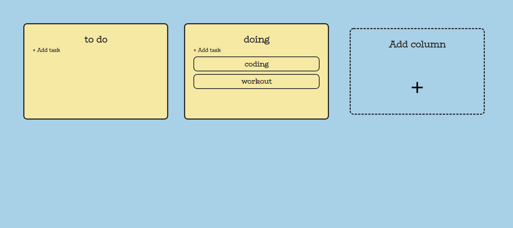

<h1 align="center"> MERN Kanban </h1>
<h3 align="center"> A kanban made with Mongo + Express + React + Node.</h3>

A little project I'm working on to learn about React and Mongo.

<h3> Main directory structure </h3>
<ul>
  <li><b>client:</b> clientside.
    <ul>
      <li><b>src: </b> React code.</li>
      <li><b>public: </b> HTML, CSS, and compiled JavaScript ( = Static files. HTML will be sent from server with GET("/"))    request).
      </li>
    </ul>
  </li>
  <li><b>server/src:</b> serverside.
    <ul>
      <li><b>index.js:</b> front controller, handles all requests.</li>
      <li><b>logic:</b> Business logic layer. </li>
      <li><b>integration:</b> Database operations layer and configuration (MongoDB). </li>
    </ul>
  </li>
</ul>
